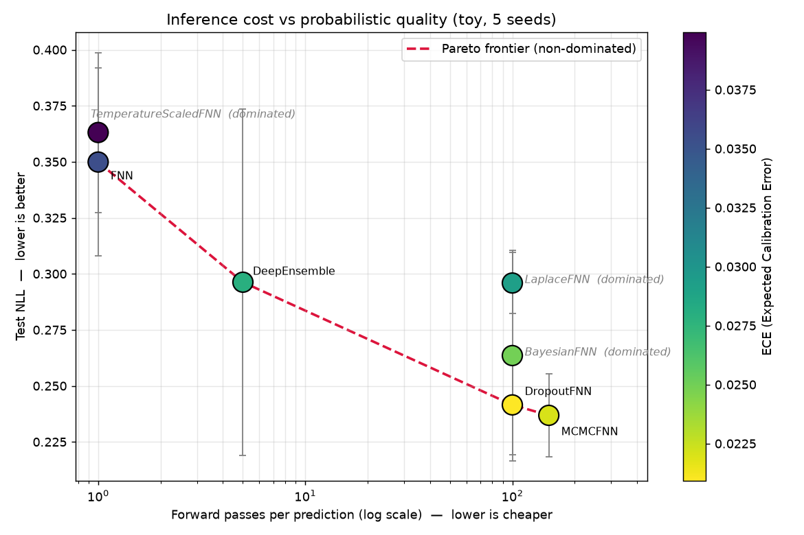
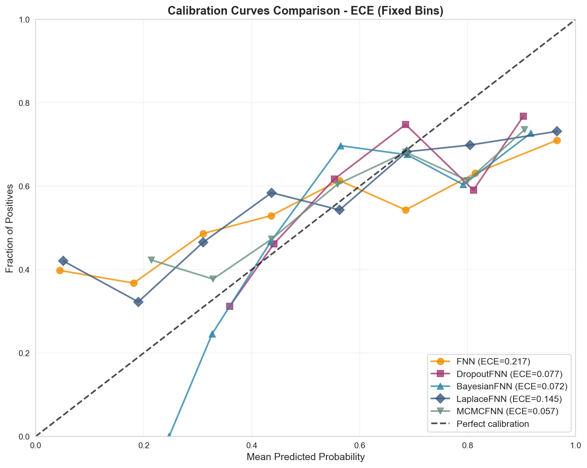
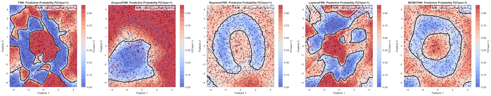
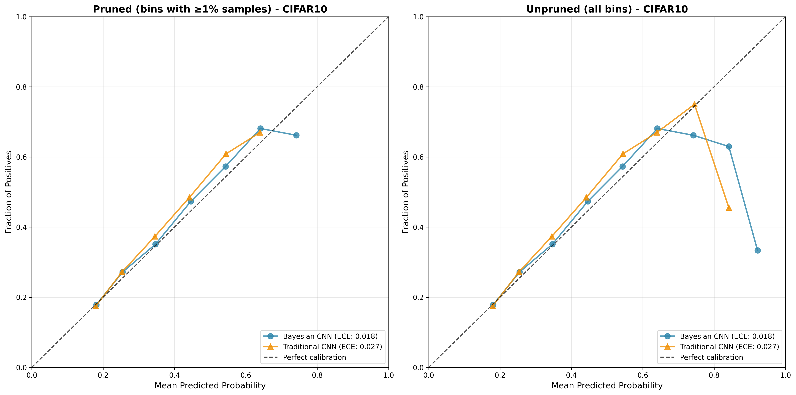
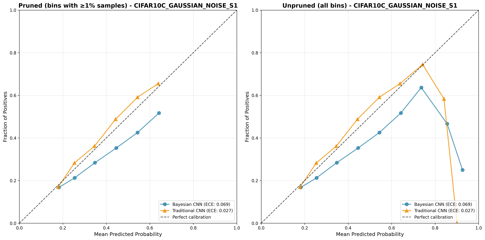
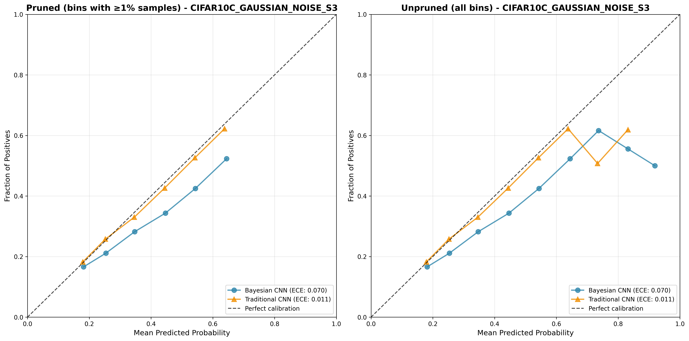

# uqbench

**A calibration & uncertainty-quantification benchmark across Bayesian and non-Bayesian methods, under distribution shift.** Built in JAX/Flax, with custom Bayesian layers, a unified method registry, and committed, reproducible results.

The contribution is not any single method — it is the honest cross-method *map* of the accuracy / calibration / compute / robustness trade-off.

---

## What we found

On a controlled 2D classification task (5 seeds), **uncertainty quality is largely decoupled from accuracy** — every method lands at ~0.90 accuracy, but they differ sharply on probabilistic metrics:

- **Sampling-based methods win on calibration and proper scoring.** MCMC (NUTS) is the quality ceiling on NLL, Brier, and OOD, with MC-Dropout close behind — but they cost 100–150 forward passes per prediction.
- **Deep ensembles give most of that benefit at a fraction of the compute** (5 forward passes): they beat the single-pass baselines on every probabilistic metric while staying far cheaper than the sampling methods.
- **The cheap single-pass baselines (plain FNN, temperature scaling) are worst on NLL/Brier**, and temperature scaling did *not* reliably improve top-label calibration on this task (high-variance ECE across seeds).
- **Bayes-by-Backprop — the nominally "Bayesian" method — is the *worst* at detecting out-of-distribution inputs.** Its variational posterior collapses toward a point estimate (σ_median ≈ 0.01), so it is overconfident off-manifold.
- **No method reliably flags far-field OOD** by predictive entropy (all AUROC < 0.5 — i.e. *worse than random*: these models are confidently wrong away from the training manifold). MCMC is the least bad.

In short: the methods that win are the most expensive (MCMC) and the most cost-effective (deep ensembles); the approximate-Bayesian middle does not pay for itself here, and off-manifold uncertainty is an unsolved failure mode across the board.

---

## Results

### Toy 2D benchmark — mean ± std over 5 seeds

Two overlapping Gaussians, one per class. Lower is better for NLL/Brier/ECE/ACE/AURC; higher is better for Accuracy/OOD-AUROC. `Fwd` = forward passes per prediction (inference cost).

| Method | Accuracy | NLL | ECE | AURC | OOD-AUROC | Fwd |
|---|---|---|---|---|---|---|
| FNN (deterministic) | 0.895 ± 0.006 | 0.350 ± 0.042 | 0.035 ± 0.007 | 0.036 ± 0.004 | 0.262 ± 0.016 | 1 |
| TemperatureScaled | 0.895 ± 0.006 | 0.363 ± 0.036 | 0.040 ± 0.014 | 0.036 ± 0.004 | 0.261 ± 0.015 | 1 |
| **DeepEnsemble** | 0.898 ± 0.004 | 0.296 ± 0.077 | 0.028 ± 0.012 | 0.028 ± 0.007 | 0.296 ± 0.084 | **5** |
| DropoutFNN (MC) | 0.906 ± 0.008 | 0.241 ± 0.022 | **0.021 ± 0.006** | **0.023 ± 0.006** | 0.282 ± 0.083 | 100 |
| BayesianFNN (BBB) | 0.903 ± 0.010 | 0.264 ± 0.047 | 0.025 ± 0.005 | 0.025 ± 0.007 | 0.184 ± 0.026 | 100 |
| LaplaceFNN (last-layer) | 0.895 ± 0.006 | 0.296 ± 0.014 | 0.029 ± 0.010 | 0.053 ± 0.008 | 0.353 ± 0.093 | 100 |
| **MCMCFNN (NUTS)** | 0.906 ± 0.006 | **0.237 ± 0.019** | 0.022 ± 0.007 | **0.023 ± 0.006** | **0.449 ± 0.048** | 150 |

One column per axis: **Accuracy** (discrimination), **NLL** (overall probabilistic quality), **ECE** (calibration), **AURC** (selective prediction), **OOD-AUROC** (OOD detection), **Fwd** (forward passes / inference cost). Lower is better except Accuracy and OOD-AUROC. Reproduce with `python scripts/benchmark_toy.py --seeds 0,1,2,3,4` → writes [`experiments/results/toy_benchmark.json`](experiments/results/toy_benchmark.json).

<details>
<summary>Full metrics (incl. Brier and ACE)</summary>

Brier corroborates NLL and ACE corroborates ECE — both pairs rank the methods identically, which is why only NLL and ECE appear above.

| Method | Accuracy | NLL | Brier | ECE | ACE | AURC | OOD-AUROC | Fwd |
|---|---|---|---|---|---|---|---|---|
| FNN (deterministic) | 0.895 ± 0.006 | 0.350 ± 0.042 | 0.166 ± 0.008 | 0.035 ± 0.007 | 0.037 ± 0.004 | 0.036 ± 0.004 | 0.262 ± 0.016 | 1 |
| TemperatureScaled | 0.895 ± 0.006 | 0.363 ± 0.036 | 0.168 ± 0.008 | 0.040 ± 0.014 | 0.040 ± 0.008 | 0.036 ± 0.004 | 0.261 ± 0.015 | 1 |
| DeepEnsemble | 0.898 ± 0.004 | 0.296 ± 0.077 | 0.155 ± 0.012 | 0.028 ± 0.012 | 0.034 ± 0.007 | 0.028 ± 0.007 | 0.296 ± 0.084 | 5 |
| DropoutFNN (MC) | 0.906 ± 0.008 | 0.241 ± 0.022 | 0.141 ± 0.009 | 0.021 ± 0.006 | 0.027 ± 0.009 | 0.023 ± 0.006 | 0.282 ± 0.083 | 100 |
| BayesianFNN (BBB) | 0.903 ± 0.010 | 0.264 ± 0.047 | 0.146 ± 0.012 | 0.025 ± 0.005 | 0.025 ± 0.003 | 0.025 ± 0.007 | 0.184 ± 0.026 | 100 |
| LaplaceFNN (last-layer) | 0.895 ± 0.006 | 0.296 ± 0.014 | 0.167 ± 0.008 | 0.029 ± 0.010 | 0.041 ± 0.007 | 0.053 ± 0.008 | 0.353 ± 0.093 | 100 |
| MCMCFNN (NUTS) | 0.906 ± 0.006 | 0.237 ± 0.019 | 0.140 ± 0.010 | 0.022 ± 0.007 | 0.023 ± 0.006 | 0.023 ± 0.006 | 0.449 ± 0.048 | 150 |

**Metric definitions.** NLL & Brier are proper scoring rules (they back up the lossy ECE summary). ECE uses top-label confidence binning (Guo et al. 2017); ACE uses adaptive/quantile bins (Kumar et al. 2019). AURC is the area under the risk–coverage curve (selective prediction). OOD-AUROC separates in-distribution test points from a far-field annulus by predictive entropy.

</details>

### Cost vs. quality frontier (toy)



Plotting inference cost (forward passes, log scale) against NLL exposes the trade-off directly. The non-dominated frontier is **FNN → DeepEnsemble → MC-Dropout → MCMC** — and the three approximate-Bayesian / post-hoc methods (**Bayes-by-Backprop, last-layer Laplace, temperature scaling**) are all *dominated*: another method is at least as good on NLL for equal-or-lower cost. Deep ensembles sit at the elbow — most of the sampling-method gain at 5 passes instead of 100+. Regenerate with `python scripts/plot_pareto.py`.

### Reliability (toy)

| Calibration curves | Predictive posterior |
|---|---|
|  |  |

### Calibration under distribution shift (CIFAR-10 → CIFAR-10-C)

Following Ovadia et al. 2019 ("Can You Trust Your Model's Uncertainty?"), we evaluate calibration as corruption intensity increases. Calibration curves drift away from the diagonal as Gaussian-noise severity rises from clean → s1 → s3:

| Clean | Gaussian noise s1 | Gaussian noise s3 |
|---|---|---|
|  |  |  |

> **Caveat (honest):** the CIFAR-10 backbones here are small-capacity convnets trained on a downsampled subset (and some runs were interrupted), so the CIFAR results are a *qualitative shift demonstration*, not a headline accuracy benchmark. The quantitative cross-method comparison is the multi-seed toy table above. Scaling the CIFAR-10/100 backbones to full accuracy is tracked work.

---

## Methods

All methods implement a common `train` / `predict_proba` / `inference_cost` interface in [`uqbench/models/method_registry.py`](uqbench/models/method_registry.py):

| Method | Family | Uncertainty source | Cost |
|---|---|---|---|
| `FNN` | Deterministic | None (single softmax) | 1× |
| `TemperatureScaledFNN` | Post-hoc | Calibrated temperature on a held-out split | 1× |
| `DeepEnsemble` | Ensemble | Disagreement across independently-seeded nets | N× |
| `DropoutFNN` | MC sampling | Monte-Carlo dropout at inference | N× |
| `BayesianFNN` | Variational (Bayes-by-Backprop) | Posterior weight samples (custom Bayesian layers) | N× |
| `LaplaceFNN` | Post-hoc Bayesian | Last-layer Gaussian (Laplace) approximation | N× |
| `MCMCFNN` | MCMC (NUTS, via BlackJAX) | Posterior samples — gold-standard reference | N× |

---

## When to use what (engineering guidance, consistent with the table)

- **Tight latency budget:** start with a deterministic net; if calibration matters, **deep ensembles** are the best calibration-per-compute option before paying for MC sampling. Temperature scaling is the cheapest add-on but was not a reliable calibration fix on this task.
- **Best probabilistic performance, moderate compute:** **MC-Dropout** or **deep ensembles**.
- **High-fidelity uncertainty reference / offline analysis:** **MCMC (NUTS)** — best metrics, but hundreds of forward passes and careful sampler diagnostics.
- **Epistemic-uncertainty research:** **Bayes-by-Backprop**, with the caveat that mean-field VI is prone to posterior collapse and under-dispersed uncertainty (it was the worst OOD detector here) and is sensitive to prior scale / KL weighting.
- **Out-of-distribution safety:** no method here is trustworthy off-manifold — treat predictive entropy / max-softmax as weak OOD signals and prefer explicit rejection or a dedicated OOD detector.

---

## Quickstart

```bash
# Environment (uv recommended; requires Python 3.11)
uv venv --python 3.11 .venv && source .venv/bin/activate
uv pip install -r requirements.txt
uv pip install -e .

# Reproduce the multi-seed toy benchmark table (writes experiments/results/toy_benchmark.json)
python scripts/benchmark_toy.py --seeds 0,1,2,3,4

# Hyperparameter search (Optuna TPE) for the toy methods
python scripts/hyperopt_toy.py --model-type all

# Run the test suite (calibration math is unit-tested against synthetic distributions)
pytest
```

---

## Project structure

```
uqbench/
├── models/                # method_registry + FNN, DropoutFNN, BayesianFNN,
│   │                      #   LaplaceFNN, MCMCFNN, TemperatureScaledFNN, CNN variants
│   └── layers/            # custom JAX Bayesian Dense / Conv2D layers
├── evaluation/            # calibration (ECE/MCE/ACE/Brier/curves), metrics (AUROC/F1), ood
├── training/              # trainer, optimizers (Adam + gradient clipping, VI β warmup)
├── data/                  # CIFAR-10/100 + toy dataset loaders
├── utils/                 # Orbax checkpointing, model export, visualization
└── api/                   # FastAPI predictive-uncertainty endpoint

scripts/
├── benchmark_toy.py       # multi-seed runner that produces the results table above
├── hyperopt_toy.py        # Optuna hyperparameter optimization
└── train.py / train_all.py / evaluate_all.py
experiments/
├── results/               # committed metrics (toy_benchmark.json) + calibration figures
└── hyperopt/              # tuned hyperparameters
notebooks/                 # demos / drivers (excluded from GitHub language stats)
tests/                     # pytest suite for the evaluation metrics
```

---

## References

- Guo et al. (2017), *On Calibration of Modern Neural Networks.*
- Kumar et al. (2019), *Verified Uncertainty Calibration.*
- Ovadia et al. (2019), *Can You Trust Your Model's Uncertainty? Evaluating Predictive Uncertainty Under Dataset Shift.*
- Blundell et al. (2015), *Weight Uncertainty in Neural Networks* (Bayes by Backprop).
- Lakshminarayanan et al. (2017), *Simple and Scalable Predictive Uncertainty Estimation using Deep Ensembles.*

## License

MIT — see [LICENSE](LICENSE).
